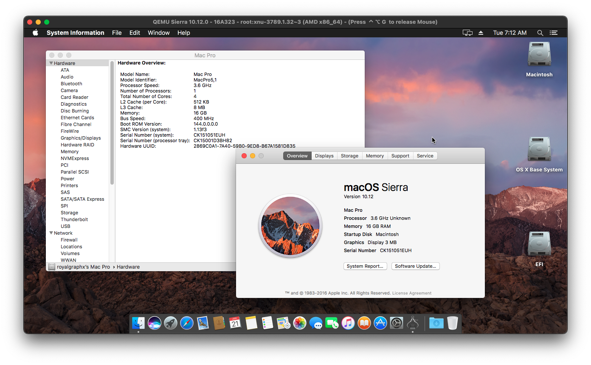

# AMD Kernel Patches for OpenCore
###### Try these patches at your own risk, and always keep an EFI backup.

# Purpose

Binary kernel patches to enable almost native AMD CPU support on OS X.

Support Chart

| Release Name | Status | Notes |
| --- | --- | --- |
| Sierra | Boots Successfully | "getCPUIDInfo unknown CPU family" Need to update to proper CPU Family ID. |
| El Capitan | Incomplete | None |
| Yosemite | Incomplete | None |
| Mavericks | Incomplete | None |
| Mountain Lion | Incomplete | None |
| Lion | Incomplete | None |
| Snow Leopard | Incomplete | None |
| Leopard | Work-In-Progress | Research Phase Currently Kernel Panics. |
| Tiger | Work-In-Progress | Research Phase Currently Kernel Panics. |

# Preliminary Information

### OpenCore Quirks

Ensure the Kernel Quirk `ProvideCurrentCpuInfo` is enabled. OpenCore 0.7.1 or newer is required. You should NOT be using an outdated copy of OpenCore, this requirement has long been deprecated. Make sure to **enable** this quirk or the system **won't boot**. You're only warned once.

### Note for Zen 4 CPUs

We do not have any people on Zen 4 available for testing at this moment, no official support is provided at this time. Zen 3 FTW (not really, give us time).

### Patch List

Depending on the specific property list you use for your target OS X installation, you can get any of the following 12 patches that are backported from High Sierra:

| Base | Patch Name | Comment |
| --- | --- | --- |
| _cpuid_set_info | cpuid_cores_per_package set to const | (user-specified) |
| _cpuid_set_info | GenuineIntel to AuthenticAMD | None |
| _commpage_populate | Remove rdmsr | None |
| _cpuid_set_cache_info | CPUID proper instead of 4 | None |
| _cpuid_set_generic_info | Remove wrmsr(0x8B) | None |
| _cpuid_set_generic_info | Replace rdmsr(0x8B) with constant 186 | None |
| _cpuid_set_generic_info | Set flag=1 | None |
| _cpuid_set_generic_info | Disable check to allow leaf7 | None |
| _cpuid_set_cpufamily | Force CPUFAMILY_INTEL_PENRYN | None |
| _mtrr_update_action | Fix PAT on AMD CPUs | None |
| _i386_init | Remove 3 rdmsr calls | None |
| None | Remove version check and panic | None |

### Configuring cpuid_cores_per_package patch.

The Core Count per Package patch needs to be modified to boot your system. The first kernel patch is the required to be updated no matter what property list you choose. Update the `Replace` value only.

| OS X Version | Default Value | Example Value |
| --- | --- | --- |
| 10.12 | BA 00 00 00 00 00 | BA 04 00 00 00 00 |
| 10.11 | TBD | TBD |
| 10.10 | TBD | TBD |
| 10.9 | TBD | TBD |
| 10.8 | TBD | TBD |
| 10.7 | TBD | TBD |
| 10.6 | TBD | TBD |
| 10.5 | TBD | TBD |
| 10.4 | B8 00 00 00 | B8 04 00 00 |

From the table above, replace `<BX XX>` with the hexadecimal value matching your physical core count. Do not use your CPU's thread count. See the table below for the values matching your CPU core count.

| Core Count | Hexadecimal |
| --- | --- |
| 4 Core | `04` |
| 6 Core | `06` |
| 8 Core | `08` |
| 12 Core | `0C` |
| 16 Core | `10` |
| 24 Core | `18` |
| 32 Core | `20` |

## Features

- Leverages OpenCore to run OS X on AMD CPUs without a custom built kernel.

## Disadvantages

- No 32-bit support (OPEMU)

## Supported AMD CPUs

| Family | Codename | Product Name |
| --- | --- | --- |
| 17h and 19h | Zen | Ryzen, Threadripper, Athlon 2xxGE |
| 16h | Jaguar | A Series (including AM4 A-Series) |
| 15h | Bulldozer | FX Series |

## Gallery

<h3 align="center">macOS Sierra 10.12.0</h3>

  

## AMD Kernel Patches Credits

If any credits are missing, they are to be added in future commits.

- [RoyalGraphX](https://github.com/RoyalGraphX) for the idea to add support for older OS X releases, updating PAT for Sierra, updating _cpuid_set_cache_info, _cpuid_set_cpufamily, researching cpuid_cores_per_package on older OS X.

- [Zormeister](https://github.com/zormeister) for the idea to add support for older OS X releases, initial patch matching confirmations for High Sierra -> Sierra backporting effort, cpuid_cores_per_package effort

- [Dhinak G](https://github.com/dhinakg), helping reverse-engineer functions for new Find/Replace values in Tiger, for CPUID 4 and Cores Per Package patches

- 

- 

## AMD Vanilla Credits

- [AlGrey](https://github.com/AlGreyy) for the idea and creating the patches.

- [XLNC](https://github.com/XLNCs) for maintaining patches for various macOS versions.

- [Acidanthera](https://github.com/acidanthera) for OpenCore.

- [CaseySJ](https://github.com/CaseySJ/) for Zen 4 IOPCIFamily patches.

- Sinetek, Andy Vandijck, spakk, Bronya, Tora Chi Yo, [Shaneee](https://github.com/Shaneee) and many others for sharing their AMD/XNU kernel knowledge.
